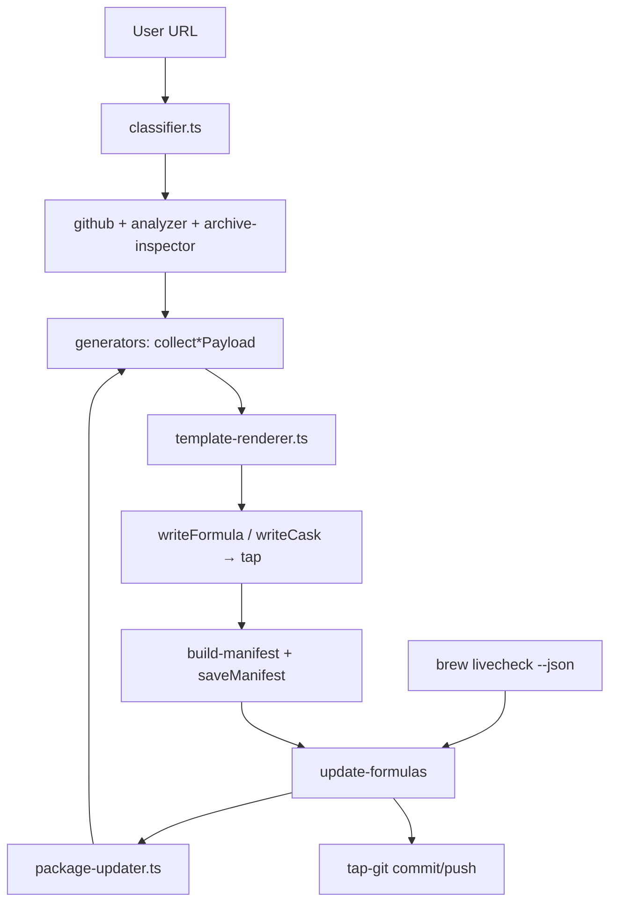

# allbrew — Homebrew Formula/Cask Generator CLI

## Current state (June 2026)

**Version:** `0.0.1` (alpha). **Branch:** `main`.

The core generator is **implemented and shipping**. Recent work on `main` moved beyond “generate once” into **managed updates**: every generated package can save a manifest and be regenerated headlessly when `brew livecheck` reports a newer registry/release version.

### What works today

| Area | Status |
|------|--------|
| URL → formula/cask generation (12 generators) | ✓ |
| Interactive + `--manual` mode | ✓ |
| Package-manager formulas (pip, npm, cargo, go) + livecheck | ✓ |
| Binary / source / script / cask / MAS paths | ✓ |
| `brew services` block inference + flags | ✓ |
| TypeScript template renderer + `test:templates` parity suite | ✓ |
| Manifest persistence (`~/.config/allbrew/packages/<name>.json`) | ✓ |
| `allbrew update-formulas` (stdin JSON or `brew livecheck`) | ✓ |
| `allbrew hooks install` + `allbrew service install` (launchd) | ✓ |
| Release script → GitHub release + tap formula | ✓ |
| First-run setup (`allbrew init`) — local tap, GitHub remote, `brew tap` auto-registration | ✓ |
| Auto `brew update` + `brew install` after each generation | ✓ |
| Three-tier Vitest suite: unit (261), integration (64), E2E catalog (15, DRY_RUN gated) | ✓ |

### What is not done

- **README examples** validated for every generator path
- **MAS install by app name** (URL with `/id{number}` only)
- **Uninstall/zap** verification across generators
- **Future ecosystems:** NuGet/dotnet-tool, Ruby gem, Swift SPM; **binary/cask generator** for DMG-only desktop apps (Electron/Avalonia)
- **Ruby/tebako renderer** — experimental branch paused ([tebako-ruby-binary-status.md](./tebako-ruby-binary-status.md))

### Side experiment (paused)

Branch `experiment/ruby-generators` explored a **tebako-packaged Ruby** formula renderer (`allbrew-generate` binary) to replace TS string templates. Infrastructure is built but **real tebako binaries were never produced**. `main` uses **TypeScript template modules** instead.

---

## Tech stack

| Layer | Choice |
|-------|--------|
| Runtime | **Bun 1.0+** (`#!/usr/bin/env bun`, TypeScript executed directly) |
| Language | **TypeScript** (`tsc --noEmit` via `bun run check`) |
| CLI | **commander** + **@inquirer/prompts** |
| GitHub | **octokit** |
| UX | **chalk**, **ora** |
| HTTP / crypto | Bun `fetch`, `node:crypto` (SHA256 streaming) |
| Output | Homebrew **Ruby** `.rb` files (generated as strings, not evaluated) |
| Config | `~/.config/allbrew/config.json` |
| Manifests | `~/.config/allbrew/packages/*.json` |
| Distribution | `brew tap tariqwest/allbrew`, `bun install -g`, or release tarball |

---

## Architecture

### Generation flow (unchanged core)

1. User provides URL (CLI arg or prompt)
2. **classifier.ts** → strategy (github-repo, bash-script, archive, cask-dmg, mac-app-store)
3. **github.ts** / **analyzer.ts** / **archive-inspector.ts** → metadata, install method, service hints
4. **generators/*.ts** → collect typed **payload** + download artifacts for SHA256
5. **template-renderer.ts** → render Ruby from `lib/templates/formula/*` or `lib/templates/cask/*`
6. **utils.writeFormula** / **writeCask** → user's tap `Formula/` or `Casks/`
7. **build-manifest.ts** + **saveManifest** → persist re-generation inputs



### Managed updates

When a formula/cask is generated, allbrew saves a **PackageManifest**:

```json
{
  "name": "marimo",
  "kind": "formula",
  "generator": "pip-package",
  "tapPath": "~/homebrew-mytapp",
  "source": { "packageName": "marimo" },
  "options": {},
  "recordedVersion": "0.x",
  "recordedAt": "..."
}
```

**`allbrew update-formulas`** reads `brew livecheck --installed --newer-only --json` (or stdin), loads manifests for outdated names, re-runs the matching `collect*Payload` + template renderer, commits to the tap, and optionally pushes.

**Automation:**

- `allbrew hooks install` → shell wrapper at `$(brew --prefix)/etc/allbrew-brew-wrap` (runs `update-formulas` after `brew update`)
- `allbrew service install` → LaunchAgent + `scripts/update-managed.sh` on a schedule (configurable hours via `config set-update-schedule`)

### First-run setup

`allbrew init` (or `resolveTapPath` on first generation) creates a local tap directory, optionally connects to a GitHub repo, and auto-registers the tap with `brew tap <user>/<name> <path>`.

- Local-only mode: uses the system username for the tap slug
- GitHub mode: prompts for a PAT or browser OAuth, creates/links `homebrew-<name>` repo, sets the git origin, and persists `githubUser`, `githubToken`, and `remoteMode` to `~/.config/allbrew/config.json`
- Configurable later via: `allbrew config set-tap`, `set-token`, `set-remote`

### Auto-install

After every successful generation, allbrew runs:

1. `brew update` — refreshes the tap index
2. `brew install --formula <filePath>` or `brew install --cask <filePath>` — installs immediately

Failures are non-fatal; the manual install command is printed.

### Template layer (post-refactor)

Generators no longer embed large Ruby strings. They build **typed payloads** (`lib/template-payload.ts`) and delegate to:

| Template | Generator |
|----------|-----------|
| `binary_release` | binary-release |
| `build_from_source` | build-from-source |
| `npm_package` | npm-package |
| `pip_package` | pip-package |
| `cargo_package` | cargo-package |
| `go_package` | go-package |
| `script_install` | script-install |
| `source_archive` | source-archive |
| `raw_binary` | raw-binary |
| `cask_app` | cask-app |
| `github_release` | github-release-cask |
| `mas_app` | mas-app |

`bun run test:templates` — 12 fixture payloads, byte-for-byte parity checks.

### Formula dependency injection

Every generated **formula** gets:

```ruby
depends_on "tariqwest/allbrew/allbrew"
```

so the tap stays linked to allbrew. Casks are not injected.

---

## Project structure

```
homebrew-allbrew/
  bin/allbrew.ts              # CLI: generate, config, update-formulas, hooks, service
  lib/
    cli.ts                    # Orchestration: classify, route, prompt, generate, save manifest
    setup.ts                  # First-run tap setup + GitHub remote + brew tap
    classifier.ts
    github.ts
    analyzer.ts
    sha256.ts
    archive-inspector.ts
    config.ts
    manifest.ts               # ~/.config/allbrew/packages/
    build-manifest.ts
    update-formulas.ts
    package-updater.ts        # Headless re-generation per generator
    tap-git.ts
    brew-hooks.ts
    launchd-service.ts
    template-renderer.ts
    template-payload.ts
    utils.ts
    generators/               # collect*Payload + thin generate* wrappers
    templates/
      formula/                # 9 TS template modules
      cask/                   # 3 TS template modules
  tests/
    unit/                     # Vitest unit tests (mocked, offline)
    integration/              # Live API tests (PyPI, npm, GitHub tarballs, DMG)
    e2e/                      # Catalog-driven brew install tests
  scripts/
    release.ts
    test-templates.ts
    test-update-formulas.ts
    update-managed.sh
  .agent/plans/
    package-manager-test-cases.md      # Authoritative test-case catalog (research)
    Package manager app examples from google.md  # Unverified Gemini starting matrix
    tebako-ruby-binary-status.md        # Paused Ruby binary experiment
```

**Note:** `Formula/` and `Casks/` live in the **user's tap checkout** (default `~/homebrew-mytapp`), not in this repo.

---

## Generators (summary)

| Generator | Output | Install / deps | Livecheck |
|-----------|--------|----------------|-----------|
| `binary-release` | Formula | GitHub release tarballs | `:github_latest` |
| `build-from-source` | Formula | cmake/autotools/make/meson | tag / github |
| `npm-package` | Formula | `node`, `std_npm_args` | npm registry |
| `pip-package` | Formula | `virtualenv`, transitive `resource` | PyPI |
| `cargo-package` | Formula | `rust`, `std_cargo_args` | crates.io |
| `go-package` | Formula | `go`, `std_go_args` | Go module proxy |
| `script-install` | Formula | runs `.sh` with Cellar `PREFIX` | url |
| `source-archive` | Formula | build from extracted source | url |
| `raw-binary` | Formula | `bin.install` prebuilt exe | url |
| `cask-app` | Cask | DMG/ZIP `.app` URL | url |
| `github-release-cask` | Cask | release `.dmg`/`.zip` | github |
| `mas-app` | Cask | `mas` installer | MAS |

---

## CLI surface

```bash
allbrew [url]                    # generate formula/cask and auto-install
allbrew init                     # first-run setup (tap + optional GitHub remote)
allbrew config set-tap <path>
allbrew config set-token <token>
allbrew config set-remote
allbrew config set-update-auto-push <true|false>
allbrew config set-update-schedule <hours>
allbrew config show
allbrew update-formulas [--dry-run] [names...]
allbrew hooks install|uninstall
allbrew service install|uninstall
```

Key flags: `--manual`, `--name`, `--desc`, `--tap`, `--service`, `--service-command`, `--token`, `--verbose`.

Environment variables:
- `GITHUB_TOKEN` — pre-authenticate for GitHub API calls
- `ALLBREW_GITHUB_CLIENT_ID` — enable browser OAuth during `allbrew init`
- `DRY_RUN=false` — in E2E tests, use the real configured tap instead of a temp dir

---

## Approach & philosophy

1. **Homebrew as source of truth** — if README already says `brew install foo`, offer to run it instead of duplicating.
2. **Detect first, prompt when ambiguous** — releases vs README vs repo files; user can override with `--manual`.
3. **Package-manager formulas are first-class** — livecheck against registries, not just GitHub tags.
4. **Regenerate, don't hand-edit** — manifests enable `update-formulas` to refresh `.rb` files when upstream versions change.
5. **Templates over ad-hoc strings** — TS template modules + parity tests keep Ruby output consistent.
6. **Research-driven testing** — build a catalog of real apps per UI type × ecosystem before claiming generator coverage (see below).

---

## Test-case research (in progress)

**Brief + catalog:** [package-manager-test-cases.md](./package-manager-test-cases.md)

Goal: **standalone, globally installable, macOS-compatible apps not in Homebrew**, covering **TUI / Web / Desktop GUI** across pip, npm, cargo, go (and future ruby/swift/nuget).

**Discovery methods established:**

- **TUIs:** [awesome-tuis](https://github.com/rothgar/awesome-tuis) → filter HB
- **Python GUI:** `topic:pyqt` + PyPI
- **JS/TS GUI:** `topic:electron`, `electrobun`, `nodegui`, `neutralinojs`, `nwjs` + npm `bin` audit
- **Rust GUI:** `topic:egui`, `iced`, `slint`
- **Go GUI:** `topic:fyne`, apps.fyne.io
- **.NET GUI:** `topic:avalonia`, `maui`, `uno-platform`, NuGet `DotnetTool`

**Key finding:** consumer desktop GUIs often ship as **DMG/cask**, not `npm -g` / `dotnet tool install -g`. Split test tracks:

- **Tier A (generators today):** `maildev`, `Rnwood.Smtp4dev`, `s-tui`, `marimo`, `ilspycmd`, `nativefier`, `appbun`, etc.
- **Tier B (future binary/cask generator):** `webtorrent-desktop`, `OpenUtau`, `ImageGlass`, Avalonia apps

**Starting point (discredited where wrong):** [Package manager app examples from google.md](./Package%20manager%20app%20examples%20from%20google.md)

---

## Next steps (priority order)

### P0 — Validate generators with real apps

1. Run Tier A picks from `package-manager-test-cases.md` through `allbrew <url> --manual` for each generator type
2. `brew install` from tap; exercise TUI / open browser / launch GUI
3. Record failures (missing deps, wrong bin name, livecheck drift, service blocks)

### P1 — Documentation & hygiene

4. Update README with **validated** examples per URL type (replace README todo)
5. Verify overwrite prompt when `.rb` already exists in tap
6. MAS install by name lookup

### P2 — Coverage expansion

7. **`nuget-package` / `dotnet-tool` generator** — `Rnwood.Smtp4dev`, `ilspycmd`
8. **Binary/cask generator improvements** for GitHub-release DMG apps (Electron/Avalonia)
9. Ruby gem + Swift SPM generators (low ecosystem yield today)

### P3 — Quality

10. Broader automated tests (classifier, analyzer regexes) beyond template parity
11. Uninstall/zap audit for casks; formula service teardown checks
12. Revisit **tebako Ruby binary** only if TS templates become a maintenance burden

---

## Development commands

```bash
bun install
bun run check
bun run test                 # unit tests
bun run test:int             # integration tests (live APIs)
bun run test:e2e             # E2E scaffold (skipped unless E2E=1)
bun run test:all             # all three tiers
bun run test:watch
bun run test:templates
bun run test:update-formulas
bun run bin/allbrew.ts --help
DRY_RUN=1 bun run release patch
```

## Requirements

- Bun 1.0+
- macOS for cask generation, archive inspection, launchd service
- `brew`, `git` for tap workflow and livecheck updates
