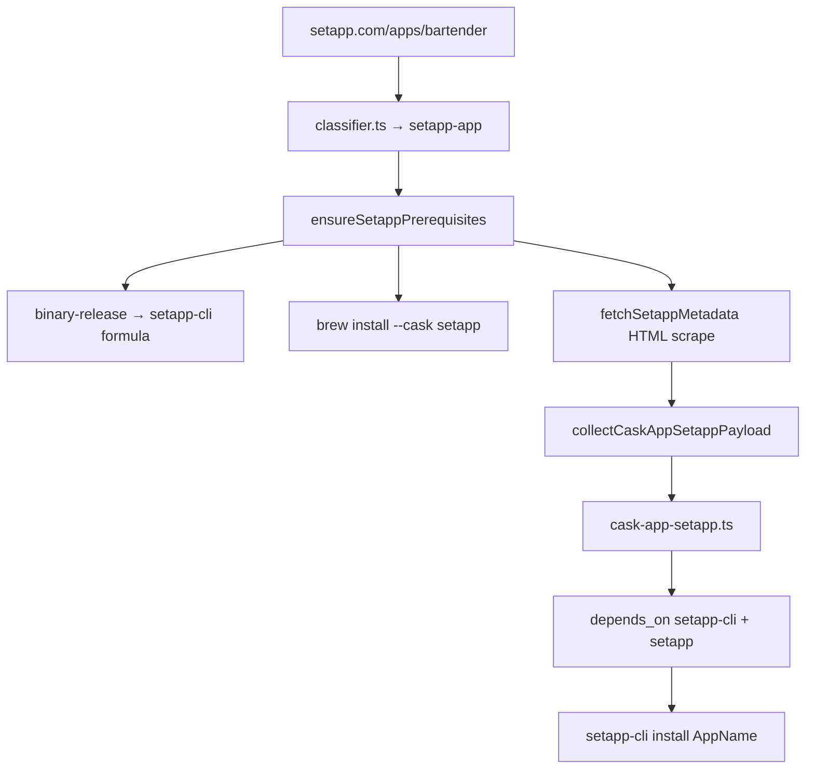

# Setapp App Store Generator Plan

## Decisions (locked)

| Question | Answer |
|----------|--------|
| Tap-qualified deps | `depends_on formula: "setapp-cli"` (unqualified; formula lives in user tap or core) |
| Auto-bootstrap | **Silent** on first `cask-app-setapp` generation: (1) generate + install `setapp-cli` formula if missing, (2) `brew install --cask setapp` if Setapp.app not present |
| v1 URL scope | **Only** `https://setapp.com/apps/{slug}` |

## Goal

Add Setapp as a first-class distribution channel in allbrew, parallel to Mac App Store + `mas`:

| Layer | MAS (today) | Setapp (proposed) |
|-------|-------------|-------------------|
| Store client | (built into macOS) | `setapp` cask (homebrew-cask) |
| CLI installer | `mas` formula | `setapp-cli` formula |
| allbrew generator | `cask-app-mas` | `cask-app-setapp` |
| User input URL | `apps.apple.com/.../id{N}` | `setapp.com/apps/{slug}` |

The [setapp-cli](https://github.com/maximlevey/setapp-cli) repo is the installer CLI — analogous to `mas`, not the app store itself.

## Architecture



## Part 1: `setapp-cli` formula (no new generator type)

Uses a dedicated **`setapp-cli` formula template** (binary release + Setapp dependency) against `https://github.com/maximlevey/setapp-cli`.

The generated formula installs the `setapp` cask at `brew install` time **only when** `Setapp.app` is not already present at `/Applications/Setapp.app` or `~/Applications/Setapp.app` (direct downloads are respected).

Release asset pattern: `setapp-cli-v{version}-macos-universal.tar.gz` (latest: v2.1.0).

### Auto-bootstrap (`lib/setapp-bootstrap.ts` — new module)

Called from `handleSetappApp()` **before** cask generation:

1. **Check `setapp-cli` formula in tap**
   - Look for `{tapPath}/Formula/setapp-cli.rb`
   - If missing: run `binary-release` generator for `https://github.com/maximlevey/setapp-cli`, write formula to tap, `brew update`
2. **Check `setapp-cli` binary installed**
   - `which setapp-cli` or `brew list setapp-cli`
   - If missing: `brew install {tapPath}/Formula/setapp-cli.rb` (same pattern as `brewAutoInstall` in `lib/cli.ts`)
3. **Check Setapp.app on system**
   - `/Applications/Setapp.app` or `~/Applications/Setapp.app` (matches [setapp-cli SetappEnvironment.swift](https://github.com/maximlevey/setapp-cli/blob/main/Sources/SetappCLI/Helpers/SetappEnvironment.swift))
   - If missing: `brew install --cask setapp` (homebrew-cask, **not** generated into user tap)
4. Failures are non-fatal warnings with retry hints (same spirit as `brewAutoInstall` update failure handling), but cask generation still proceeds — install will fail at runtime if prereqs missing.

Bootstrap is idempotent: subsequent Setapp casks skip steps already satisfied.

## Part 2: `cask-app-setapp` generator

### Classifier (`lib/classifier.ts`)

```typescript
const SETAPP_APP_RE = /^https?:\/\/setapp\.com\/apps\/([^/?#]+)/;
// → { type: 'setapp-app', url, slug }
```

Manual prompt entry in `lib/cli.ts`: `"Setapp app link"`.

### Metadata (`lib/generators/cask-app-setapp.ts`)

Scrape `https://setapp.com/apps/{slug}`:

| Field | Source |
|-------|--------|
| `slug` | URL path |
| `appName` | page `<h1>` (e.g. `bartender` → `Bartender Pro`) |
| `version` | `Version X.Y.Z` on page |
| `desc` | subtitle / first description paragraph |
| `homepage` | canonical Setapp URL |
| `name` (cask token) | `toCaskToken(slug)` unless `--name` override |

**Install key is display name**, not slug — `setapp-cli install "Bartender Pro"` per [InstallCommand.swift](https://github.com/maximlevey/setapp-cli/blob/main/Sources/SetappCLI/Commands/Install/InstallCommand.swift).

### Payload (`lib/template-payload.ts`)

```typescript
export type CaskAppSetappPayload = {
  template: "cask_app_setapp";
  name: string;
  slug: string;
  appName: string;
  version: string;
  desc: string;
  homepage: string;
  zapBlock: string;
  livecheckBlock: string;
};
```

### Template (`lib/templates/cask/cask-app-setapp.ts`)

Modeled on `lib/templates/cask/cask-app-mas.ts`:

```ruby
cask "bartender" do
  version "6.5.2"
  sha256 :no_check
  url "https://setapp.com/apps/bartender"
  name "Bartender Pro"
  desc "..."
  homepage "https://setapp.com/apps/bartender"

  livecheck do
    url "https://setapp.com/apps/bartender"
    regex(/Version\s+(\d+(?:\.\d+)+)/i)
  end

  depends_on formula: "setapp-cli"
  depends_on cask: "setapp"

  caveats <<~EOS
    Requires an active Setapp subscription and being signed in to Setapp.
  EOS

  installer script: {
    executable: "setapp-cli",
    args: ["install", "Bartender Pro"],
  }

  uninstall script: {
    executable: "setapp-cli",
    args: ["remove", "Bartender Pro"],
  }

  zap trash: ["~/Library/Application Support/Bartender Pro"]
end
```

**Key differences from MAS:**

- `depends_on cask: "setapp"` in addition to `setapp-cli` formula
- `uninstall script:` (apps live in `/Applications/Setapp/`, not `/Applications/`)
- `caveats` for subscription/login requirement
- No bundle-ID-based zap (no public API; name-only paths)

### Livecheck (`lib/generators/livecheck.ts`)

`setappAppLivecheckBlock(slug)` — regex scrape of version from app page (same URL as metadata).

### Manifest + updates

- `lib/manifest.ts`: add `"cask-app-setapp"` to `GeneratorName`
- `lib/build-manifest.ts`: `source: { setappUrl, appName }`
- `lib/package-updater.ts`: regen case + `setappLatestVersion(slug)` helper

## Part 3: Integration wiring

| File | Change |
|------|--------|
| `lib/classifier.ts` | `SETAPP_APP_RE`, `setapp-app` type |
| `lib/cli.ts` | `handleSetappApp()` + bootstrap call + generator dispatch |
| `lib/setapp-bootstrap.ts` | **new** — prerequisite checks + silent install |
| `lib/generators/cask-app-setapp.ts` | **new** |
| `lib/templates/cask/cask-app-setapp.ts` | **new** |
| `lib/template-payload.ts` | payload type + union |
| `lib/template-renderer.ts` | dispatch |
| `lib/manifest.ts` | generator name |
| `lib/build-manifest.ts` | source + version |
| `lib/package-updater.ts` | update case |
| `scripts/test-templates.ts` | 13th parity fixture |
| `tests/e2e/catalog.e2e.test.ts` | `isCaskGenerator()` |
| `AGENTS.md` | generator table row |

## Part 4: Testing

### Unit (`tests/unit/generators/cask-app-setapp.test.ts`)

- Mock HTML fixture (Bartender page snippet)
- Slug extraction, display name ≠ slug, version/desc parsing, livecheck block
- `--name` override, 404 error handling

### Unit bootstrap (`tests/unit/setapp-bootstrap.test.ts`)

- Mock `execFileAsync`, filesystem checks
- Idempotent: skips when formula/binary/Setapp.app already present
- Generates formula when `setapp-cli.rb` missing

### Integration (`tests/integration/cask-app-setapp.int.test.ts`)

- Live scrape: `bartender`, `cleanshot`, `typingmind`
- `assertValidCask()` on rendered Ruby

### Template parity

- Add fixture to `scripts/test-templates.ts`

### E2E (skipped)

```json
{
  "name": "bartender-setapp",
  "url": "https://setapp.com/apps/bartender",
  "generator": "cask-app-setapp",
  "skip": true,
  "notes": "Requires Setapp subscription"
}
```

### Test case table

- Add Setapp entries to `.agents/plans/allbrew-test-cases.md` (Bartender, CleanShot X)

## Implementation phases

### Phase 1 — Core generator + bootstrap

1. `setapp-bootstrap.ts` + unit tests
2. Classifier + CLI routing + `handleSetappApp()`
3. `cask-app-setapp` generator + template + payload + renderer
4. Unit + integration tests + template parity
5. `bun run check && bun run test`

### Phase 2 — Managed updates (complete)

1. Manifest source + `package-updater` case
2. `setappLatestVersion()` for `update-formulas`
3. `package-updater` + `build-manifest` unit test coverage

### Phase 3 — Docs + catalog (complete)

1. `AGENTS.md` generator row
2. Test case table entries (Bartender Pro, CleanShot X)
3. README mention under cask types
4. `add-test-case` skill + E2E catalog entry (skipped)

## Risks

| Risk | Mitigation |
|------|------------|
| HTML scrape breaks on redesign | Multiple regex fallbacks; integration tests catch drift |
| `brew install --cask setapp` needs network | Warn on failure; user can install manually |
| Bootstrap writes to tap silently | Ora spinners: "Ensuring setapp-cli formula...", "Installing Setapp..." |
| Subscription required at install time | `caveats` stanza in generated cask |

## Deferred (not v1)

- README `setapp.com` link detection in analyzer
- Bundle-ID zap blocks (needs local SQLite or public API)
- Homebrew-core upstream of `setapp-cli`
- App-name-only input without Setapp URL

## Reference: existing `cask-app-mas` pattern

The Setapp generator follows the same collect → payload → template → manifest flow as `lib/generators/cask-app-mas.ts` and `lib/templates/cask/cask-app-mas.ts`. Setapp swaps `mas` → `setapp-cli`, numeric ID → display name, adds `depends_on cask: "setapp"`, and uses `uninstall script:` instead of `delete:`.