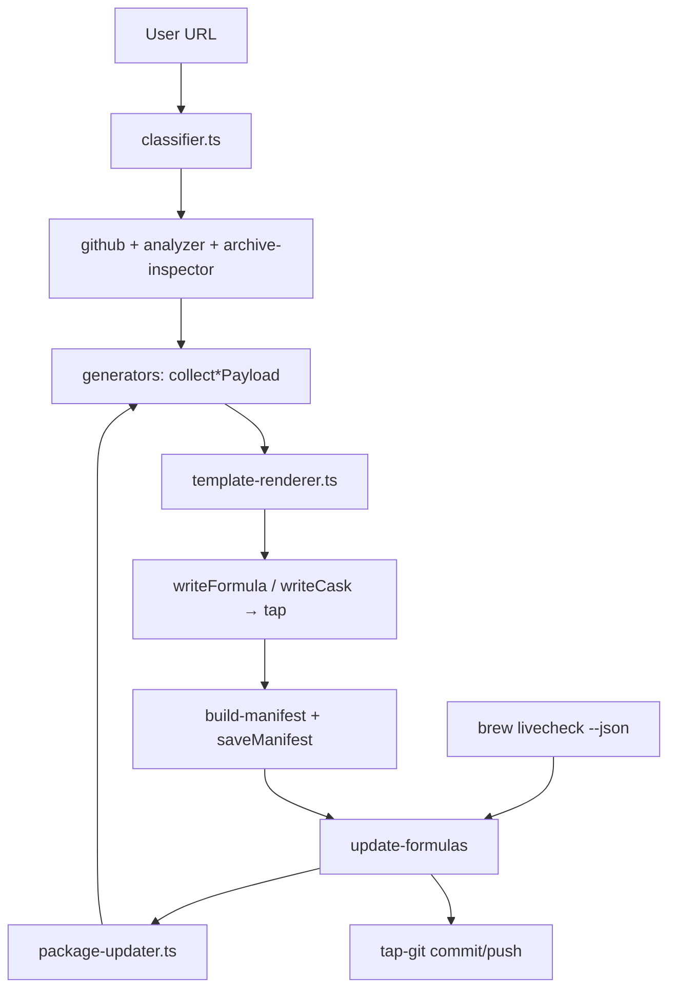

# AGENTS.md

> **Deeper planning & architecture docs** live in [`.agents/plans/`](./.agents/plans/):
> - [`allbrew-test-cases-deep-research-2026-06.md`](./.agents/plans/allbrew-test-cases-deep-research-2026-06.md) — full research narrative, per-ecosystem tables, generator-coverage analysis
> - [`allbrew-test-cases.md`](./.agents/plans/allbrew-test-cases.md) — combined master table of ~230 test-case apps across all 12 generators
> - [`tebako-ruby-binary-status.md`](./.agents/plans/tebako-ruby-binary-status.md) — paused Ruby binary experiment

## Project overview

**allbrew** is a Bun/TypeScript CLI that accepts an arbitrary URL (GitHub repo, bash script, app binary/archive, or Mac App Store link) and generates the correct Homebrew formula or cask Ruby file, writing it into the user's configured tap at `Formula/` or `Casks/`. Generated packages persist manifests and can be regenerated headlessly via `allbrew update-formulas` after `brew livecheck` reports a newer version.

**Status:** `0.0.1` (alpha). Core generator is implemented and shipping on `main`.

## Tech stack

| Layer | Choice |
|-------|--------|
| Runtime | **Bun 1.0+** (`#!/usr/bin/env bun`, TypeScript executed directly) |
| Language | **TypeScript** (`tsc --noEmit` via `bun run check`) |
| CLI | **commander** + **@inquirer/prompts** |
| GitHub | **octokit** |
| UX | **chalk**, **ora** |
| HTTP / crypto | Bun `fetch`, `node:crypto` (SHA256 streaming) |
| Output | Homebrew **Ruby** `.rb` files (generated as strings, not evaluated) |
| Config | `~/.config/allbrew/config.json` |
| Manifests | `~/.config/allbrew/packages/*.json` |
| Distribution | `brew tap tariqwest/allbrew`, `bun install -g`, or release tarball |

## Build and test commands

```bash
bun install                        # install dependencies
bun run check                      # TypeScript type-check (tsc --noEmit)
bun run test                       # unit tests (Vitest, mocked, offline)
bun run test:int                   # integration tests (live APIs: PyPI, npm, GitHub, DMG)
bun run test:e2e                   # E2E catalog tests (requires E2E=1)
bun run test:all                   # all three tiers
bun run test:watch                 # unit tests in watch mode
bun run test:templates             # 12 fixture payloads, byte-for-byte parity checks
bun run test:update-formulas       # update-formulas integration test
bun run bin/allbrew.ts --help      # verify CLI runs
DRY_RUN=1 bun run release patch    # preview a release without side effects
```

Always run `bun run check` and `bun run test` before committing. Integration and E2E tests hit live APIs and may be slow or flaky — run them separately when validating specific generators.

## Testing instructions

- **Unit tests** (`tests/unit/`): 261 tests, fully mocked, offline-safe. Run with `bun run test`.
- **Integration tests** (`tests/integration/`): 95 tests hitting live registries (PyPI, npm, crates.io, GitHub tarballs, DMG downloads). Run with `bun run test:int`.
- **E2E tests** (`tests/e2e/`): 21 catalog-driven tests that generate formulas/casks and attempt real `brew install`. Gated behind `E2E=1` env var. Run with `bun run test:e2e`.
- **Template parity tests** (`scripts/test-templates.ts`): 12 fixture payloads with byte-for-byte Ruby output comparison. Run with `bun run test:templates`.

To run a single test file:

```bash
bun run vitest run --project=unit tests/unit/classifier.test.ts
```

To run tests matching a pattern:

```bash
bun run vitest run -t "classifies GitHub"
```

## Code style

- **TypeScript strict mode** — `tsc --noEmit` must pass with zero errors.
- **No runtime compilation** — Bun executes `.ts` files directly; do not add a build step.
- **Templates over ad-hoc strings** — All Ruby output goes through typed payload objects (`lib/template-payload.ts`) and template modules (`lib/templates/`). Never embed large Ruby strings in generators.
- **Generators collect, templates render** — Each generator's job is to gather a typed `*Payload` and delegate to `template-renderer.ts`. Generators should not produce Ruby directly.
- **Homebrew Ruby conventions** — Follow existing Homebrew formula/cask style (`std_npm_args`, `std_cargo_args`, `on_macos`/`on_arm` blocks, etc.).
- **No comments or documentation** unless explicitly requested by the user.
- **Imports at the top of the file** — never mid-file.

## Architecture

### Generation flow

1. User provides URL (CLI arg or prompt)
2. **`classifier.ts`** → strategy (github-repo, bash-script, archive, cask-dmg, mac-app-store)
3. **`github.ts`** / **`analyzer.ts`** / **`archive-inspector.ts`** → metadata, install method, service hints
4. **`generators/*.ts`** → collect typed **payload** + download artifacts for SHA256
5. **`template-renderer.ts`** → render Ruby from `lib/templates/formula/*` or `lib/templates/cask/*`
6. **`utils.writeFormula`** / **`writeCask`** → user's tap `Formula/` or `Casks/`
7. **`build-manifest.ts`** + **`saveManifest`** → persist re-generation inputs



### Generators (12 total)

| Generator | Output | Install / deps | Livecheck |
|-----------|--------|----------------|-----------|
| `binary-release` | Formula | GitHub release tarballs | `:github_latest` |
| `build-from-source` | Formula | cmake/autotools/make/meson | tag / github |
| `npm-package` | Formula | `node`, `std_npm_args` | npm registry |
| `pip-package` | Formula | `virtualenv`, transitive `resource` | PyPI |
| `cargo-package` | Formula | `rust`, `std_cargo_args` | crates.io |
| `go-package` | Formula | `go`, `std_go_args` | Go module proxy |
| `script-install` | Formula | runs `.sh` with Cellar `PREFIX` | url |
| `source-archive` | Formula | build from extracted source | url |
| `raw-binary` | Formula | `bin.install` prebuilt exe | url |
| `cask-app` | Cask | DMG/ZIP `.app` URL | url |
| `github-release-cask` | Cask | release `.dmg`/`.zip` | github |
| `mas-app` | Cask | `mas` installer | MAS |

Additional generators implemented: `swift-spm`, `dotnet-tool`, `ruby-gem`, `swift-mint`. These follow the same payload → template pattern.

### Template layer

Generators build **typed payloads** (`lib/template-payload.ts`) and delegate to template modules. `bun run test:templates` runs 12 fixture payloads with byte-for-byte parity checks.

### Managed updates

When a formula/cask is generated, allbrew saves a **PackageManifest** JSON to `~/.config/allbrew/packages/`. `allbrew update-formulas` reads `brew livecheck --installed --newer-only --json`, loads manifests for outdated names, re-runs the matching generator + template renderer, commits to the tap, and optionally pushes.

**Automation:**

- `allbrew hooks install` → shell wrapper at `$(brew --prefix)/etc/allbrew-brew-wrap` (runs `update-formulas` after `brew update`)
- `allbrew service install` → LaunchAgent + `scripts/update-managed.sh` on a configurable schedule

### Formula dependency injection

Every generated **formula** gets `depends_on "tariqwest/allbrew/allbrew"` so the tap stays linked to allbrew. Casks are not injected.

## Project structure

```
homebrew-allbrew/
  bin/allbrew.ts              # CLI entry point
  lib/
    cli.ts                    # Orchestration: classify, route, prompt, generate, save manifest
    setup.ts                  # First-run tap setup + GitHub remote + brew tap
    classifier.ts             # URL → strategy routing
    github.ts                 # GitHub API (releases, README, repo files via Octokit)
    analyzer.ts               # README/repo analysis: install method, service hints
    sha256.ts                 # Streaming SHA256 computation
    archive-inspector.ts      # Download, extract, sub-classify archive contents
    config.ts                 # ~/.config/allbrew/config.json
    manifest.ts               # Package manifest types + persistence
    build-manifest.ts         # Manifest construction after generation
    update-formulas.ts        # Headless re-generation from livecheck
    package-updater.ts        # Per-generator re-generation logic
    tap-git.ts                # Git commit/push to tap repo
    brew-hooks.ts             # brew update hook integration
    launchd-service.ts        # LaunchAgent for scheduled updates
    template-renderer.ts      # Dispatch payload → template module
    template-payload.ts       # Typed payload union (all generators)
    utils.ts                  # Name conversion, writeFormula/writeCask, dep injection
    generators/               # collect*Payload + thin generate* wrappers
    templates/
      formula/                # TS template modules (formula output)
      cask/                   # TS template modules (cask output)
  tests/
    unit/                     # Vitest unit tests (mocked, offline)
    integration/              # Live API tests (PyPI, npm, GitHub, DMG)
    e2e/                      # Catalog-driven brew install tests
  scripts/
    release.ts                # Version bump, tarball, GitHub release, tap formula push
    test-templates.ts         # Template parity test runner
    test-update-formulas.ts   # update-formulas integration test runner
    update-managed.sh         # Launchd scheduled update script
  .agents/plans/              # Deeper planning & research docs
```

**Note:** `Formula/` and `Casks/` live in the **user's tap checkout** (default `~/homebrew-mytapp`), not in this repo.

## CLI surface

```bash
allbrew [url]                    # generate formula/cask and auto-install
allbrew init                     # first-run setup (tap + optional GitHub remote)
allbrew config set-tap <path>
allbrew config set-token <token>
allbrew config set-remote
allbrew config set-update-auto-push <true|false>
allbrew config set-update-schedule <hours>
allbrew config show
allbrew update-formulas [--dry-run] [names...]
allbrew hooks install|uninstall
allbrew service install|uninstall
```

Key flags: `--manual`, `--name`, `--desc`, `--tap`, `--service`, `--service-command`, `--token`, `--verbose`.

## Environment variables

- `GITHUB_TOKEN` — pre-authenticate for GitHub API calls
- `ALLBREW_GITHUB_CLIENT_ID` — enable browser OAuth during `allbrew init`
- `DRY_RUN=false` — in E2E tests, use the real configured tap instead of a temp dir
- `E2E=1` — enable E2E test tier

## Security considerations

- **Never commit `GITHUB_TOKEN` or PATs** to the repo. Use environment variables or `allbrew config set-token`.
- **`.env` is gitignored** — safe for local development secrets.
- **Generated Ruby is strings, not evaluated** — allbrew never executes Ruby; it produces `.rb` files as text.
- **SHA256 verification** — all downloaded artifacts are checksummed before being referenced in formulas/casks.
- **No network calls in unit tests** — unit tests are fully mocked. Integration/E2E tests make real API calls.

## Design principles

1. **Homebrew as source of truth** — if README already says `brew install foo`, offer to run it instead of duplicating.
2. **Detect first, prompt when ambiguous** — releases vs README vs repo files; user can override with `--manual`.
3. **Package-manager formulas are first-class** — livecheck against registries, not just GitHub tags.
4. **Regenerate, don't hand-edit** — manifests enable `update-formulas` to refresh `.rb` files when upstream versions change.
5. **Templates over ad-hoc strings** — TS template modules + parity tests keep Ruby output consistent.
6. **Research-driven testing** — a catalog of ~230 real apps per UI type × ecosystem validates generator coverage (see `.agents/plans/`).

## Current status

### What works today

| Area | Status |
|------|--------|
| URL → formula/cask generation (12+ generators) | done |
| Interactive + `--manual` mode | done |
| Package-manager formulas (pip, npm, cargo, go) + livecheck | done |
| Swift SPM, dotnet-tool, ruby-gem, swift-mint generators | done |
| Binary / source / script / cask / MAS paths | done |
| `brew services` block inference + flags | done |
| TypeScript template renderer + parity suite | done |
| Manifest persistence + `allbrew update-formulas` | done |
| `allbrew hooks install` + `allbrew service install` (launchd) | done |
| Release script → GitHub release + tap formula | done |
| First-run setup (`allbrew init`) | done |
| Auto `brew update` + `brew install` after generation | done |
| Three-tier Vitest suite: unit (261), integration (95), E2E (21) | done |

### What is not done

- README examples validated for every generator path
- MAS install by app name (URL with `/id{number}` only)
- Uninstall/zap verification across generators
- Binary/cask generator improvements for DMG-only desktop apps (Electron/Avalonia)

## Requirements

- Bun 1.0+
- macOS for cask generation, archive inspection, launchd service
- `brew`, `git` for tap workflow and livecheck updates
