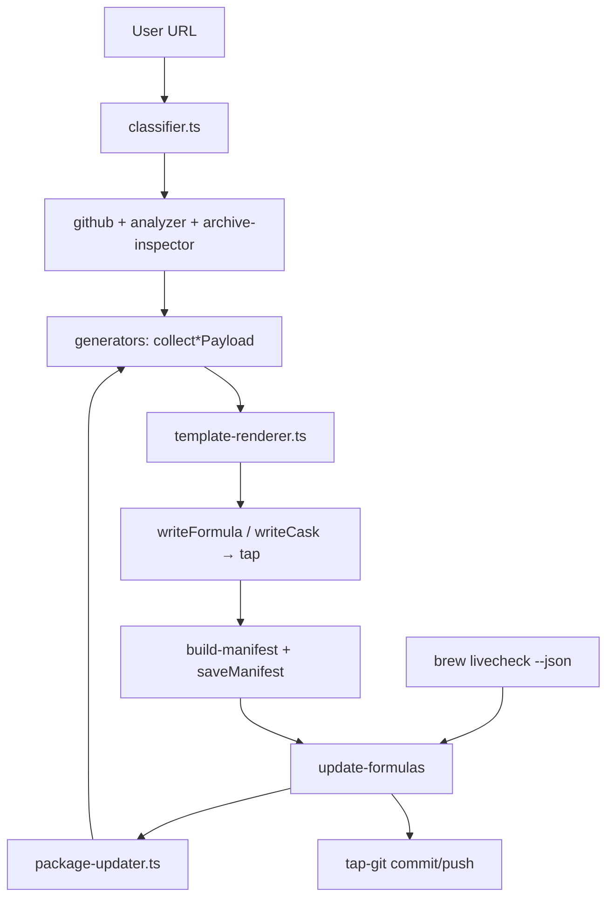

# AGENTS.md

> **Deeper planning & architecture docs** live in [`.agents/plans/`](./.agents/plans/):
> - [`fable-app-review-2026-07-11.md`](./.agents/plans/fable-app-review-2026-07-11.md) — codebase-wide security, architecture, edge-case, and feature review
> - [`allbrew-test-cases.md`](./.agents/plans/allbrew-test-cases.md) — combined master table of test-case apps across all 17 generators
> - [`allbrew-test-cases-deep-research-2026-06.md`](./.agents/plans/allbrew-test-cases-deep-research-2026-06.md) — full research narrative, per-ecosystem tables, generator-coverage analysis
> - [`allbrew-scan.md`](./.agents/plans/allbrew-scan.md) — plan to adopt already-installed apps into the tap
> - [`allbrew-switch.md`](./.agents/plans/allbrew-switch.md) — plan to migrate manually installed apps to official Homebrew packages
> - [`allbrew-hooks-uninstall-detection.md`](./.agents/plans/allbrew-hooks-uninstall-detection.md) — plan to detect out-of-band uninstalls and clean up stale state
> - [`setapp-generator.md`](./.agents/plans/setapp-generator.md) — Setapp app store generator (`cask-app-setapp`)
> - [`tebako-ruby-binary-status.md`](./.agents/plans/tebako-ruby-binary-status.md) — paused Ruby binary experiment
> - [`allbrew-e2e-lume-vm.md`](./.agents/plans/allbrew-e2e-lume-vm.md) — Lume macOS VM + Cua Driver harness for E2E/real-world testing
> - [`allbrew-tap-update-e2e.md`](./.agents/plans/allbrew-tap-update-e2e.md) — E2E tap + livecheck update cycle tests with synthetic fixtures
> - [`allbrew-user-lifecycle-test-plan.md`](./.agents/plans/allbrew-user-lifecycle-test-plan.md) — user-lifecycle test gaps (services, uninstall residuals, hooks, personas, Lume nightly journeys)
> - [`allbrew-local-test-cleanup-rollback.md`](./.agents/plans/allbrew-local-test-cleanup-rollback.md) — snapshot/restore for local E2E runs so they don't pollute the user's workspace
> - [`allbrew-agent-skills.md`](./.agents/plans/allbrew-agent-skills.md) — proposed agent skills for orientation, diagnosis, and repair (12 skills across understand/diagnose/fix tiers)

## Project overview

**allbrew** is a Bun/TypeScript CLI that accepts an arbitrary URL (GitHub repo, bash script, app binary/archive, Mac App Store link, or Setapp app link) and generates the correct Homebrew formula or cask Ruby file, writing it into the user's configured tap at `Formula/` or `Casks/`. Generated packages persist manifests and can be regenerated headlessly via `allbrew update-formulas` after `brew livecheck` reports a newer version.

**Status:** `0.0.1` (alpha). Core generator is implemented and shipping on `main`.

## Tech stack

| Layer | Choice |
|-------|--------|
| Runtime | **Bun 1.0+** (primary, `#!/usr/bin/env bun`, TS executed directly). Also runs under **Node 18+** (via [`tsx`](https://github.com/privatenumber/tsx) ESM loader, declared as `optionalDependencies`) and **Deno 2.0+** (via npm-compat). The npm `bin` entry is `bin/allbrew.js`, a runtime-dispatching shim that imports `bin/allbrew.ts` directly under Bun/Deno or registers `tsx/esm` under Node. `bin/allbrew.ts` keeps its `#!/usr/bin/env bun` shebang as the Bun-native entry. |
| Language | **TypeScript** (`tsc --noEmit` via `bun run check`) |
| CLI | **commander** + **@inquirer/prompts** |
| GitHub | **octokit** |
| UX | **chalk**, **ora** |
| HTTP / crypto | global `fetch` (Bun/Node 18+/Deno 2+), `node:crypto` (SHA256 streaming) |
| Output | Homebrew **Ruby** `.rb` files (generated as strings, not evaluated) |
| Config | `~/.config/allbrew/config.json` |
| Manifests | `~/.config/allbrew/packages/*.json` |
| Distribution | `brew tap tariqwest/allbrew`, `bun install -g`, `npm install -g`, `deno install -g npm:allbrew`, or release tarball |

## Build and test commands

```bash
bun install                        # install dependencies
bun run check                      # TypeScript type-check (tsc --noEmit)
bun run test                       # unit tests (Bun test runner, mocked, offline)
bun run test:int                   # integration tests (live APIs: PyPI, npm, GitHub, DMG)
bun run test:int:gate              # integration tests excluding quarantined tests
bun run test:live-smoke            # live smoke subset (one package per registry, allowed to fail)
bun run test:e2e                   # E2E catalog tests (requires E2E=1)
bun run test:e2e-heavy             # E2E heavy real packages (requires E2E_HEAVY=1)
bun run test:e2e-tap               # E2E tap + update cycle tests (requires E2E_TAP=1)
bun run test:all                   # all tiers
bun run test:watch                 # unit tests in watch mode
bun run test:templates             # 13 fixture payloads, byte-for-byte parity checks
bun run test:update-formulas       # update-formulas integration test
bun run bin/allbrew.ts --help      # verify CLI runs
DRY_RUN=1 bun run release patch    # preview a release without side effects
bun run vm:test                    # run the test suite in a Lume macOS VM (see "E2E VM testing")
bun run vm:test:e2e                # E2E catalog profile (acquires exclusive /opt/homebrew)
bun run vm:test:e2e-tap            # E2E tap profile (acquires exclusive /opt/homebrew)
```

Always run `bun run check` and `bun run test` before committing. Integration and E2E tests hit live APIs and may be slow or flaky — run them separately when validating specific generators.

## Testing instructions

- **Unit tests** (`tests/unit/`): 868 tests, fully mocked, offline-safe. Run with `bun run test`. Includes suites for analyzer, brew-hooks, launchd-service, config, sha256, uninstall-residuals, test-cleanup-registry, bin-name-matrix, classifier-conflict-matrix, failure-injection, quarantine, list-packages, and cli-commands (Tier 0/A/B/C coverage).
- **Integration tests** (`tests/integration/`): 95 tests hitting live registries (PyPI, npm, crates.io, GitHub tarballs, DMG downloads). Run with `bun run test:int`.
- **E2E tests** (`tests/e2e/`): 21 catalog-driven tests that generate formulas/casks and attempt real `brew install`. Gated behind `E2E=1` env var. Run with `bun run test:e2e` or `scripts/test-e2e.sh`.
- **E2E tap tests** (`tests/e2e-tap/`): 39 tests that exercise the full off-machine cycle (generate → commit → push to remote tap → `brew tap`/`brew update`/`brew install <name>` → verify) plus the livecheck-driven update cycle. Includes a service lifecycle test (`service.e2e-tap.test.ts`) that validates `--service` generation, stanza inspection, direct launch + HTTP probe, and `brew services` start/stop round-trip. Uses a synthetic fixture server emulating npm/PyPI/crates.io/Go proxy/RubyGems/NuGet/GitHub APIs with fake artifacts. Gated behind `E2E_TAP=1` env var. Run with `bun run test:e2e-tap` or `scripts/test-e2e-tap.sh`. The `dotnet-package` suite is **quarantined** (fixture-server nupkg build exceeds Bun.serve's 10s idleTimeout, failing generate/update); opt back in with `E2E_TAP_QUARANTINE=1` — the dotnet generator is marked experimental until it's green.
- **E2E heavy tests** (`tests/e2e/heavy.e2e.test.ts`): 6 heavy real packages (one per ecosystem) that catch packaging failures small fixtures hide. Gated behind `E2E_HEAVY=1`. Run with `bun run test:e2e-heavy`.
- **E2E polluted PATH test** (`tests/e2e/polluted-path.e2e.test.ts`): verifies bin resolution to Homebrew Cellar path when a same-named dummy binary exists earlier in PATH. Gated behind `E2E=1`.
- **Template parity tests** (`scripts/test-templates.ts`): 13 fixture payloads with byte-for-byte Ruby output comparison. Run with `bun run test:templates`.

### Uninstall residual checks (Tier A)

After every successful `brew uninstall` in e2e and e2e-tap, `assertUninstallResiduals()` (from `tests/helpers/uninstall-residuals.ts`) verifies the package is gone from `brew list`, the binary (formulae) or app path (casks) is absent, and the manifest persists (allbrew is the system of record; `deleteManifest` is dead code; `allbrew remove`/doctor/OOB detection in Tier C will handle deletion). The helper does NOT assert `manifestGone` because plain `brew uninstall` has no call path that deletes a manifest.

### E2E execution mode

- **VM execution** (recommended for clean isolation): use `bun run vm:test:*` (see "E2E VM testing" below). The harness auto-starts the Lume VM, creates a per-project macOS user, acquires an exclusive `/opt/homebrew` sparsebundle for Homebrew-mutating profiles, runs the requested profile, captures a post-test readout, and detaches the prefix in `finally`.
- **Local filesystem execution**: use `scripts/test-e2e.sh` and `scripts/test-e2e-tap.sh` for local runs with snapshot/restore + readout capture. Extra args are passed to `bun test` as file filters. Direct `bun run test:e2e` / `bun run test:e2e-tap` also work (snapshot/restore is handled by the test runners).

| Flag | Applies to | Effect |
|------|-----------|--------|
| `--no-cleanup` | `test-e2e-tap.sh` | Skip `~/.config/allbrew` snapshot/restore |

### Local E2E cleanup & rollback

When E2E tests run on the local filesystem (via `--local` or automatic fallback), both tiers snapshot `~/.config/allbrew/` before tests and restore it after, so local runs do not pollute the user's real allbrew config or manifests. Snapshots are preserved under `tests/e2e-runs/local/<timestamp>/` (with a `latest` symlink), mirroring the Lume VM run records under `tests/e2e-runs/<timestamp>/`.

Each local run record contains:

| File | Contents |
|------|----------|
| `readout.txt` | Post-test system state captured BEFORE restore: macOS info, allbrew config/manifests, Homebrew taps/formulae/casks/Cellar/Caskroom/cache, MAS apps, Setapp, /Applications, tap repo git state, host repo git state, test results summary |
| `test-output.log` | Captured stdout/stderr from the test run (written by the e2e-tap runner, or via `tee` in the e2e wrapper) |
| `metadata.json` | Machine-readable run metadata (timestamp, run dir, host repo, git SHA/branch) |
| `snapshot.json` | Snapshot handle (run dir, config backup dir, empty flag) |
| `config-backup/` | The pre-test `~/.config/allbrew/` contents used for restore |

- **E2E-tap**: snapshot/restore + readout capture is handled by a wrapper script (`scripts/e2e-tap-local-runner.ts`) that snapshots `~/.config/allbrew`, runs `bun test tests/e2e-tap/`, captures a readout, and restores state. Per-describe teardown also disposes disposable taps, uninstalls their packages, stops registered service agents, and kills orphaned fixture processes. The runner writes test output to `<runDir>/test-output.log` and passes its path via `ALLBREW_TEST_LOG` so the readout can include a Test Results Summary.
- **E2E catalog**: snapshot/restore + readout capture is in `beforeAll`/`afterAll` of `tests/e2e/catalog.e2e.test.ts`. `afterAll` also uninstalls any catalog apps still installed (e.g. a test failed before its uninstall step), stops registered services, kills orphaned fixtures, and purges orphaned registry files. The wrapper script `scripts/test-e2e.sh` tees output and passes `ALLBREW_TEST_LOG` the same way.
- **Test cleanup registry** (Tier 0, T0.2): `tests/helpers/test-cleanup-registry.ts` tracks fixture process PIDs and Homebrew service agents started during a test run in per-process JSON files under `${TMPDIR}/allbrew-test-registries/`. On clean teardown the runner stops registered services, kills orphaned fixtures (those whose owning test process is dead), and purges orphaned registry files. This covers the Ctrl-C / crash case where Vitest teardown does not run.
- **Manual recovery**: if a test run is killed, run `scripts/test-local-cleanup.sh`:
  - `--dry-run` (default): show test residue, available snapshots, and the cleanup registry (fixture PIDs + registered services) without changing anything.
  - `--restore`: restore `~/.config/allbrew` from the latest snapshot.
  - `--force`: restore + untap disposable `test/e2e-tap-*` taps and uninstall their packages + stop registered Homebrew services from dead test processes + kill orphaned fixture processes + purge orphaned registry files.
- **Debug escape hatch**: `scripts/test-e2e-tap.sh --no-cleanup` disables the runner's snapshot/restore for debugging on the local filesystem.
- **Lume-first lifecycle tests** (Tier 0, T0.4): destructive lifecycle tests (services, zap, hooks — A1/A3/A4) live under `tests/e2e-lume/` and are gated by `tests/helpers/lifecycle-gate.ts`. They run on Lume by default (`ALLBREW_LUME=1`, set by the VM harness); local execution requires explicit opt-in via `ALLBREW_LIFECYCLE_LOCAL=1`. Use the `lifecycleDescribe()` wrapper or `shouldRunLifecycleTests()` check so they skip cleanly otherwise.

To run a single test file:

```bash
bun test tests/unit/classifier.test.ts
```

To run tests matching a pattern:

```bash
bun test tests/unit/ --test-name-pattern "classifies GitHub"
```

## E2E VM testing

For real-world, isolated testing on a clean macOS install, allbrew consumes the [`macos-testing-harness`](https://github.com/tariqwest/macos-testing-harness) as a vendored `file:` dependency and defines its VM test suite in [`test-suite.ts`](./test-suite.ts) at the repo root. The harness is invoked via the `bun run vm:*` package scripts.

> **Migration status:** the legacy `scripts/e2e-vm-*.sh` orchestration has been removed after the `acceptance` profile passed a VM run. VM execution is now exclusively through `bun run vm:*`; local filesystem runs use `scripts/test-e2e.sh` / `scripts/test-e2e-tap.sh` or the direct `bun run test:e2e*` scripts. See [`vendor/macos-testing-harness/.agents/plans/allbrew-migration.md`](./vendor/macos-testing-harness/.agents/plans/allbrew-migration.md) for the full migration plan.

### Quick reference (`bun run vm:*`)

```bash
bun run vm:init                # one-time VM creation per host
bun run vm:setup               # create project user + provision sparsebundle + install bun + bun install
bun run vm:test                # default profile (check + unit + templates)
bun run vm:test:int            # integration profile
bun run vm:test:e2e            # E2E catalog (acquires exclusive /opt/homebrew)
bun run vm:test:e2e-tap        # E2E tap + update cycle (acquires exclusive /opt/homebrew)
bun run vm:test:user-journeys  # Tier A nightly user journeys (A1/A3/A4)
bun run vm:test:all            # integration + e2e + e2e-tap
bun run vm:nightly             # reset --nuclear + setup + user-journeys
bun run vm:readout             # capture post-test state
bun run vm:reset               # detach /opt/homebrew, delete sparsebundle, delete project user
bun run vm:reset:nuclear       # above + wipe Cellar/Caskroom/Caches
bun run vm:ssh 'sw_vers'       # run a command inside the VM as the project user
bun run vm:sync                # rsync repo to remote Lume host
bun run vm:clone allbrew-clean # clone the VM
bun run vm:teardown            # stop or delete the VM (--stop | --delete via vm:ssh)
```

### Profiles and the exclusive Homebrew prefix

`test-suite.ts` declares these profiles via the harness SDK (`defineTestSuite`):

| Profile | Steps / journeys | Acquires `/opt/homebrew`? |
|---------|------------------|---------------------------|
| `default` | check, unit, templates | No |
| `integration` | integration | No |
| `e2e` | E2E catalog | Yes |
| `e2e-tap` | E2E tap + update cycle | Yes |
| `user-journeys` | A1 service personas (npm/pip/go), A3 hooks smoke, A4 zap persona | Yes |

The `e2e`, `e2e-tap`, and `user-journeys` profiles are listed in `homebrewProfiles`, so the harness acquires the project user's APFS sparsebundle at `/opt/homebrew` (VM-global mutex) before running them and detaches it in `finally`. Cask installs target `$HOME/Applications` via `HOMEBREW_CASK_OPTS=--appdir=$HOME/Applications`. Concurrent bottle-correct Homebrew on one VM is not supported; use separate VMs for parallel heavy E2E.

### Nightly user-journey suite

The `user-journeys` profile runs the Tier A lifecycle journeys from `test-suite.ts` using the harness journey runner. Each journey has its own timeout, runs per-journey cleanup on pass or fail, and produces a machine-readable `tests/e2e-runs/<ts>/journeys.json`.

Run it with a clean VM precondition:

```bash
bun run vm:nightly    # reset --nuclear + setup + run --profile user-journeys
```

Or manually:

```bash
bun run vm:reset:nuclear
bun run vm:setup
bun run vm:test --profile user-journeys --no-default
```

#### Retry policy

- **Retry only transient network failures** (timeout, DNS resolution failure, HTTP 5xx from a registry or GitHub API).
- **Never retry product/service failures** (wrong `service` command, `brew services start` exit code, missing binary, zap path mismatch, LaunchAgent residue). Those are real signals.
- If a journey fails, inspect `tests/e2e-runs/<ts>/journeys.json`, `journeys.log`, and `test-output.log` before retrying. A failed run is not automatically retried by the harness.

### Local filesystem wrappers

For local runs without a VM:

```bash
scripts/test-e2e.sh                               # E2E catalog (local snapshot/restore/readout)
scripts/test-e2e-tap.sh                           # E2E tap (local snapshot/restore/readout)
scripts/test-e2e-tap.sh --no-cleanup              # skip ~/.config/allbrew snapshot/restore
```

Direct npm scripts also work: `bun run test:e2e`, `bun run test:e2e-tap`, `bun run test:e2e-heavy`.

### Remote Lume host (optional)

You can run the Lume VM on a remote Apple Silicon Mac (`homeserver.local`) while keeping the orchestration scripts and run records on your local machine. Enable it with:

```bash
export LUME_REMOTE_ENABLED=true
# LUME_REMOTE_HOST defaults to app-user@homeserver.local
# LUME_REMOTE_DIR defaults to /Users/app-user/Developer/allbrew
# LUME_REMOTE_IPSW_DIR defaults to /Users/app-user/Downloads
```

Then use the same `bun run vm:*` commands above. Before each run the harness rsyncs the local repo to `LUME_REMOTE_DIR` on the remote host, because Lume's `--shared-dir` can only mount a directory that lives on the host running the VM. The IPSW is synced once to the remote Downloads folder if it is not already there. The remote host only needs Lume installed and an active macOS user session with Virtualization Framework permissions.

Set `LUME_REMOTE_ENABLED=false` to run Lume locally instead.

### Acceptance verification

The `acceptance` profile (`bun run vm:test --profile acceptance --no-default`) passed a VM run on `allbrew-e2e` with exclusive `/opt/homebrew` (APFS sparsebundle + VM-global lock), installing `npkill` via `brew install`, verifying it with `npkill --version`, uninstalling cleanly, and detaching the prefix. Post-test readout confirmed no residual formulae, casks, launch agents, or `/Applications` leakage. The legacy `scripts/e2e-vm-*.sh` orchestration was removed after this run.

### Run records

Each test run produces a timestamped record under `tests/e2e-runs/<timestamp>/`:

| File | Contents |
|------|----------|
| `readout.txt` | Full post-test state: allbrew config/manifests, Homebrew taps/formulae/casks, MAS apps, Setapp, tap repo git state, /Applications, disk usage, test results summary, journey results |
| `test-output.log` | Captured stdout/stderr from the test run |
| `journeys.json` | Machine-readable per-journey results (when `user-journeys` profile ran) |
| `journeys.log` | Human-readable journey execution log |
| `metadata.json` | Machine-readable run metadata (timestamp, VM name, git SHA/branch, profiles, Homebrew session) |
| `reset.log` | Log of the reset operation (if reset was run) |

A `latest` symlink points to the most recent run. These records persist across resets, providing a full history of what was tested, what passed/failed, and the final system state.

## Code style

- **`tsc --noEmit` must pass with zero errors** — currently `tsconfig.json` has `strict: false`, so the project compiles under loose settings. Treat the intent as strict: prefer typed payloads over `any`, avoid unsafe casts, and do not rely on the loose compiler setting. A migration to `strict: true` (or at least `strictNullChecks`) is planned.
- **No runtime compilation** — Bun and Deno execute `.ts` files directly; Node uses the `tsx` ESM loader (registered by `bin/allbrew.js`). Do not add a separate build/emit step. Keep imports using explicit `.ts` extensions (already required by `tsconfig`'s `allowImportingTsExtensions`) so all three runtimes resolve modules identically.
- **Templates over ad-hoc strings** — All Ruby output goes through typed payload objects (`lib/template-payload.ts`) and template modules (`lib/templates/`). Never embed large Ruby strings in generators.
- **Generators collect, templates render** — Each generator's job is to gather a typed `*Payload` and delegate to `template-renderer.ts`. Generators should not produce Ruby directly.
- **Homebrew Ruby conventions** — Follow existing Homebrew formula/cask style (`std_npm_args`, `std_cargo_args`, `on_macos`/`on_arm` blocks, etc.).
- **No comments or documentation** unless explicitly requested by the user.
- **Imports at the top of the file** — never mid-file.

## Agent tool-use rules

### Editing `.agents/plans/allbrew-test-cases.md`

**Always use [`md-spreadsheet-parser`](https://github.com/fy-labs/md-spreadsheet-parser) — never raw `split('|')`.**

The master test-case table is a 24-column GFM table with cells that can contain backtick-quoted pipes (`` `cmd|flag` ``), escaped pipes, and occasional column-count irregularities. Raw string splitting silently corrupts these rows. The parser handles all GFM edge cases correctly and enforces uniform structure on round-trip.

```typescript
import { scanTablesFromFile } from 'md-spreadsheet-parser';

const [table] = scanTablesFromFile('.agents/plans/allbrew-test-cases.md');
// Read:  table.headers (string[]), table.rows (string[][])
// Edit:  table.updateCell(rowIndex, colIndex, value)
//        or mutate table.rows directly
// Write: table.toMarkdown() → regenerate the file section
```

Use `table.headers.indexOf('column_name')` to look up column positions — never hardcode numeric offsets.

Install if not present: `bun add md-spreadsheet-parser` (npm WASM package, works natively in Bun).

## Architecture

### Generation flow

1. User provides URL (CLI arg or prompt)
2. **`classifier.ts`** → strategy (github-repo, bash-script, archive, cask-dmg, mac-app-store, setapp-app)
3. **`github.ts`** / **`analyzer.ts`** / **`archive-inspector.ts`** → metadata, install method, service hints
4. **`generators/*.ts`** → collect typed **payload** + download artifacts for SHA256
5. **`template-renderer.ts`** → render Ruby from `lib/templates/formula/*` or `lib/templates/cask/*`
6. **`utils.writeFormula`** / **`writeCask`** → user's tap `Formula/` or `Casks/`
7. **`build-manifest.ts`** + **`saveManifest`** → persist re-generation inputs



### Generators (17 total)

| Generator | Output | Install / deps | Livecheck |
|-----------|--------|----------------|-----------|
| `binary-release` | Formula | GitHub release tarballs | `:github_latest` |
| `source-build` | Formula | cmake/autotools/make/meson | tag / github |
| `npm-package` | Formula | `node`, `std_npm_args` | npm registry |
| `pip-package` | Formula | `virtualenv`, transitive `resource` | PyPI |
| `cargo-package` | Formula | `rust`, `std_cargo_args` | crates.io |
| `go-package` | Formula | `go`, `std_go_args` | Go module proxy |
| `install-script` | Formula | runs `.sh` with Cellar `PREFIX` | url |
| `archive-build` | Formula | build from extracted source | url |
| `binary-direct` | Formula | `bin.install` prebuilt exe | url |
| `cask-app` | Cask | DMG/ZIP `.app` URL | url |
| `cask-app-release` | Cask | release `.dmg`/`.zip` | github |
| `cask-app-mas` | Cask | `mas` installer | MAS |
| `cask-app-setapp` | Cask | `setapp-cli` installer | Setapp page |
| `spm-package` | Formula | `swift`, `swift build` | `:github_latest` |
| `dotnet-package` | Formula | `dotnet`, `dotnet tool install` | NuGet |
| `gem-package` | Formula | `ruby`, `gem install` | rubygems.org |
| `mint-package` | Formula | `mint`, `mint install` | `:github_latest` |

### Template layer

Generators build **typed payloads** (`lib/template-payload.ts`) and delegate to template modules. `bun run test:templates` runs 13 fixture payloads with byte-for-byte parity checks.

### Managed updates

When a formula/cask is generated, allbrew saves a **PackageManifest** JSON to `~/.config/allbrew/packages/`. `allbrew update-formulas` reads `brew livecheck --installed --newer-only --json`, loads manifests for outdated names, re-runs the matching generator + template renderer, commits to the tap, and optionally pushes.

**Automation:**

- `allbrew hooks install` → shell wrapper at `$(brew --prefix)/etc/allbrew-brew-wrap` (runs `update-formulas` after `brew update`) plus macOS Folder Actions for uninstall detection (planned)
- `allbrew service install` → LaunchAgent + `scripts/update-managed.sh` on a configurable schedule

### Formula dependency injection

Every generated **formula** gets `depends_on "tariqwest/allbrew/allbrew"` so the tap stays linked to allbrew. Casks are not injected.

## Project structure

```
homebrew-allbrew/
  bin/allbrew.ts              # CLI entry point
  lib/
    cli.ts                    # Orchestration: classify, route, prompt, generate, save manifest
    setup.ts                  # First-run tap setup + GitHub remote + brew tap
    classifier.ts             # URL → strategy routing
    setapp-bootstrap.ts       # Auto-install setapp-cli + Setapp on first Setapp cask
    github.ts                 # GitHub API (releases, README, repo files via Octokit)
    analyzer.ts               # README/repo analysis: install method, service hints
    sha256.ts                 # Streaming SHA256 computation
    archive-inspector.ts      # Download, extract, sub-classify archive contents
    config.ts                 # ~/.config/allbrew/config.json
    manifest.ts               # Package manifest types + persistence
    build-manifest.ts         # Manifest construction after generation
    update-formulas.ts        # Headless re-generation from livecheck
    package-updater.ts        # Per-generator re-generation logic
    tap-git.ts                # Git commit/push to tap repo
    brew-hooks.ts             # brew update hook integration
    launchd-service.ts        # LaunchAgent for scheduled updates
    template-renderer.ts      # Dispatch payload → template module
    template-payload.ts       # Typed payload union (all generators)
    utils.ts                  # Name conversion, writeFormula/writeCask, dep injection
    generators/               # collect*Payload + thin generate* wrappers
    templates/
      formula/                # TS template modules (formula output)
      cask/                   # TS template modules (cask output)
  tests/
    unit/                     # Bun test runner unit tests (mocked, offline)
    integration/              # Live API tests (PyPI, npm, GitHub, DMG)
    e2e/                      # Catalog-driven brew install tests
  scripts/
    release.ts                # Version bump, tarball, GitHub release, tap formula push
    test-templates.ts         # Template parity test runner
    test-update-formulas.ts   # update-formulas integration test runner
    update-managed.sh         # Launchd scheduled update script
  .agents/plans/              # Deeper planning & research docs
```

**Note:** `Formula/` and `Casks/` live in the **user's tap checkout** (default `~/homebrew-mytapp`), not in this repo.

## CLI surface

```bash
allbrew [url]                    # generate formula/cask and auto-install
allbrew init                     # first-run setup (tap + optional GitHub remote)
allbrew config set-tap <path>
allbrew config set-token <token>
allbrew config set-remote
allbrew config set-update-auto-push <true|false>
allbrew config set-update-schedule <hours>
allbrew config show
allbrew update-formulas [--dry-run] [names...]
allbrew hooks install|uninstall
allbrew service install|uninstall
```

Key flags: `--manual`, `--name`, `--desc`, `--tap`, `--service`, `--service-command`, `--token`, `--verbose`.

## Environment variables

- `GITHUB_TOKEN` — pre-authenticate for GitHub API calls
- `ALLBREW_GITHUB_CLIENT_ID` — enable browser OAuth during `allbrew init`
- `DRY_RUN=false` — in E2E tests, use the real configured tap instead of a temp dir
- `E2E=1` — enable E2E test tier
- `E2E_TAP=1` — enable E2E tap + update cycle test tier
- `GITHUB_API_URL` — override GitHub API base URL (used by E2E tap tests to redirect to fixture server)
- `NPM_REGISTRY_URL` — override npm registry base URL (used by E2E tap tests)
- `PYPI_URL` — override PyPI base URL (used by E2E tap tests)
- `CRATES_URL` — override crates.io base URL (used by E2E tap tests)
- `GO_PROXY_URL` — override Go module proxy base URL (used by E2E tap tests)
- `RUBYGEMS_URL` — override RubyGems base URL (used by E2E tap tests)
- `NUGET_URL` / `NUGET_FLAT_URL` — override NuGet base URLs (used by E2E tap tests)

## Security considerations

- **Never commit `GITHUB_TOKEN` or PATs** to the repo. Use environment variables or `allbrew config set-token`.
- **`.env` is gitignored** — safe for local development secrets.
- **Generated Ruby is strings, not evaluated by allbrew** — allbrew produces `.rb` files as text. Homebrew evaluates them at `brew install` time, so generated strings must be treated as code-equivalent: escape all user-controlled values correctly.
- **SHA256 verification** — all downloaded artifacts are checksummed before being referenced in formulas/casks.
- **No network calls in unit tests** — unit tests are fully mocked. Integration/E2E tests make real API calls.

### Known security hardening in progress (see [`.agents/plans/fable-app-review-2026-07-11.md`](./.agents/plans/fable-app-review-2026-07-11.md))

| Area | Issue | Status |
|------|-------|--------|
| Ruby string escaping | `rubyEscape` does not escape Ruby interpolation (`#{...}`) or newlines; malicious metadata could inject Ruby into generated formulas. | Fix planned |
| Archive extraction | `unzip`/`tar` are invoked without path-traversal protection; a malicious archive could write outside the temp dir. | Hardening planned |
| README command execution | When a README advertises `brew install foo`, allbrew offers to run it; `&&`-split segments are executed without an allowlist. | Review planned |
| Config permissions | `~/.config/allbrew/config.json` (contains the GitHub token) is written with default umask. | Fix planned |
| HTTPS enforcement | HTTP URLs are fetched without warning. | Warning planned |
| URL fetch / SSRF | Arbitrary user-provided URLs are fetched, including private-range/link-local addresses. | Review planned |

## Design principles

1. **Homebrew as source of truth** — if README already says `brew install foo`, offer to run it instead of duplicating.
2. **Detect first, prompt when ambiguous** — releases vs README vs repo files; user can override with `--manual`.
3. **Package-manager formulas are first-class** — livecheck against registries, not just GitHub tags.
4. **Regenerate, don't hand-edit** — manifests enable `update-formulas` to refresh `.rb` files when upstream versions change.
5. **Templates over ad-hoc strings** — TS template modules + parity tests keep Ruby output consistent.
6. **Research-driven testing** — a catalog of ~230 real apps per UI type × ecosystem validates generator coverage (see `.agents/plans/`).

## Current status

### What works today

| Area | Status |
|------|--------|
| URL → formula/cask generation (17 generators) | done |
| Interactive + `--manual` mode | done |
| Package-manager formulas (pip, npm, cargo, go) + livecheck | done |
| Swift SPM, dotnet-tool, ruby-gem, swift-mint generators | done |
| Binary / source / script / cask / MAS / Setapp paths | done |
| `brew services` block inference + flags | done |
| TypeScript template renderer + parity suite | done |
| Manifest persistence + `allbrew update-formulas` | done |
| `allbrew hooks install` + `allbrew service install` (launchd) | done |
| Release script → GitHub release + tap formula | done |
| First-run setup (`allbrew init`) | done |
| Auto `brew update` + `brew install` after generation | done |
| Three-tier Bun test suite: unit, integration, E2E | done |

### What is not done

- README examples validated for every generator path
- MAS install by app name (URL with `/id{number}` only)
- Uninstall/zap verification across generators
- Binary/cask generator improvements for DMG-only desktop apps (Electron/Avalonia)
- `allbrew scan` — scan the user's system for already-installed non-Homebrew apps and retroactively create formulas/casks to track them (no reinstall, just adopt into the tap)
- `allbrew switch` — scan for apps installed via MAS, Setapp, or other package managers that are also available in Homebrew core/casks, and offer to switch to the Homebrew-managed version
- `allbrew hooks` uninstall detection — detect when tracked apps are removed outside of Homebrew/allbrew (manual deletion, MAS/Setapp uninstall) and clean up stale formulas/casks/manifests

## Agent contribution priorities

When picking up work, prefer this order unless the user requests otherwise:

1. **Security hardening** — these block safe use of automation (hooks/service) and should land before scan/switch/uninstall-detection:
   - Fix `rubyEscape` to handle Ruby interpolation and newlines.
   - Harden `archive-inspector.ts` extraction against path traversal.
   - Restrict `config.json` permissions and validate tap paths.
   - Add HTTPS warning/non-HTTPS handling.
2. **Type safety & manifest typing** — enables reliable `update-formulas` and all planned features that read manifests:
   - Replace `Record<string, unknown>` manifest sources with per-generator discriminated unions.
   - Type generator `repoInfo`/`options` and reduce `any` usage.
   - Migrate toward strict TypeScript incrementally.
3. **Operational robustness** — required before hooks/service can run safely alongside manual use:
   - Add a lock file for `update-formulas` concurrent runs.
   - Wrap livecheck JSON parsing and clean up temp dirs/partial downloads on failure.
   - Truncate launchd logs and embed absolute brew/allbrew paths in `update-managed.sh`.
4. **Planned features** — implement in this order because each builds on the previous:
   - `allbrew scan` + shared `lib/scan-detect.ts`
   - `allbrew hooks` uninstall detection (relies on scan's `appPath` metadata)
   - `allbrew switch` (relies on `scan-detect.ts` and Homebrew API matching)
5. **Small user-facing wins** — can be done in parallel once (1)–(3) are stable:
   - `allbrew list`, `allbrew info`, `allbrew remove`, `allbrew regenerate`, `allbrew doctor`
   - `--dry-run` generation output and `--json` result mode
   - Shell completions

Always open or update the relevant `.agents/plans/*.md` document before starting a new feature, and keep [`.agents/plans/fable-app-review-2026-07-11.md`](./.agents/plans/fable-app-review-2026-07-11.md) in mind — it contains the detailed rationale and file:line references for the hardening items above.

## Requirements

- Bun 1.0+
- macOS for cask generation, archive inspection, launchd service
- `brew`, `git` for tap workflow and livecheck updates
